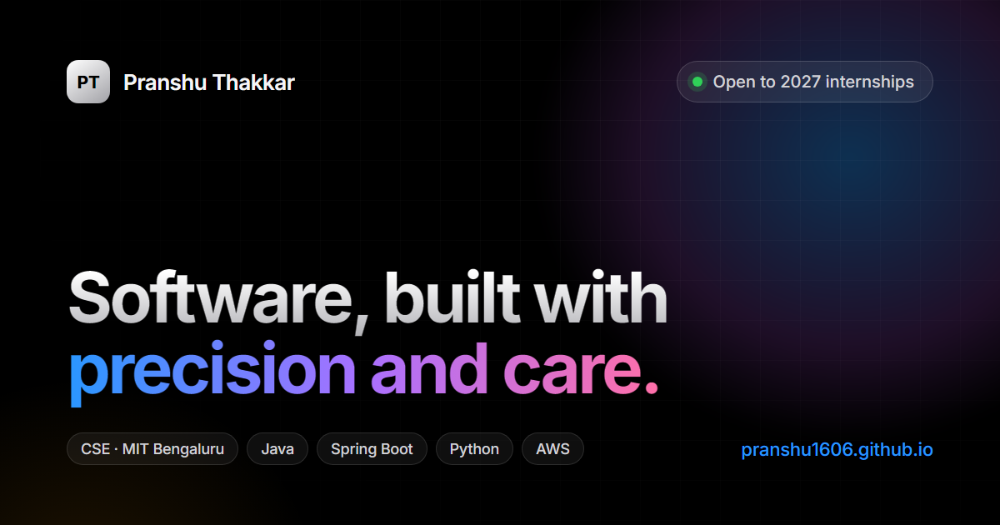

# Pranshu Thakkar — Portfolio

An Apple-inspired, single-page developer portfolio.

**Live:** https://pranshu1606.github.io



## Highlights

- **Cinematic hero** — gradient headline that eases away on scroll, and a macOS-style terminal window that tilts into place and types out an intro
- **Scroll-read statement** — a paragraph that lights up word by word as you scroll
- **Bento "At a glance" tiles** — animated counters with a cursor-following spotlight
- **Featured projects** — Distributed Order Processing (in progress) with a live architecture diagram and request trace, and KineticAI with an animated query dashboard
- **"Get the highlights" carousel** — skill cards with paddle navigation, including current AWS Cloud Practitioner prep
- **Tech Specs** — a light, Apple spec-sheet section with Core / Education / Certifications tabs
- **macOS Dock** — contact links with hover magnification
- **Spotlight search** — press `⌘K` / `Ctrl K` or `/` to jump to any section or link
- Responsive down to phone width, and respects `prefers-reduced-motion`

## Tech

Plain HTML, CSS and JavaScript in a single `index.html` — no framework, no build step, no dependencies beyond Google Fonts (Inter, JetBrains Mono). On Apple devices the system SF Pro font is used.

## Files

```text
index.html                  the whole site (markup, styles, scripts)
PranshuThakkar_CSE_GS.pdf   résumé linked from the site
og-image.png                1200×630 link-preview image (Open Graph / Twitter)
```

## Run locally

Open `index.html` directly in a browser, or serve the folder:

```bash
python -m http.server 8000
# then visit http://localhost:8000
```

## Deploy

GitHub Pages serves the `main` branch root of this repository. Commit and push to `main` and the site updates in about a minute.

## Contact

- Email: pranshuthakkar.tech@gmail.com
- GitHub: [pranshu1606](https://github.com/pranshu1606)
- LinkedIn: [Pranshu Thakkar](https://www.linkedin.com/in/pranshu-t-aba933325/)
- LeetCode: [pranshu_thakkar](https://leetcode.com/u/pranshu_thakkar/)
